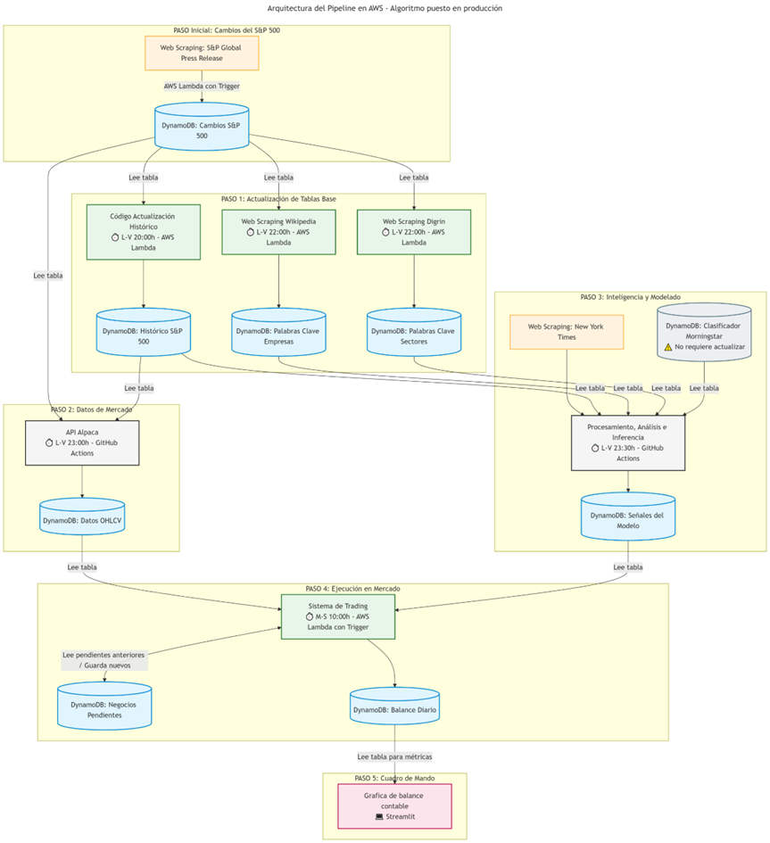
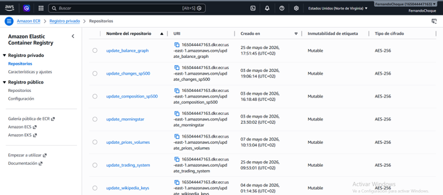
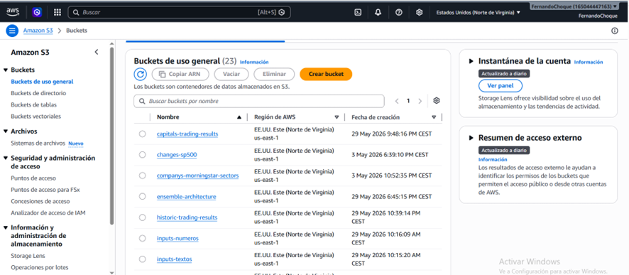
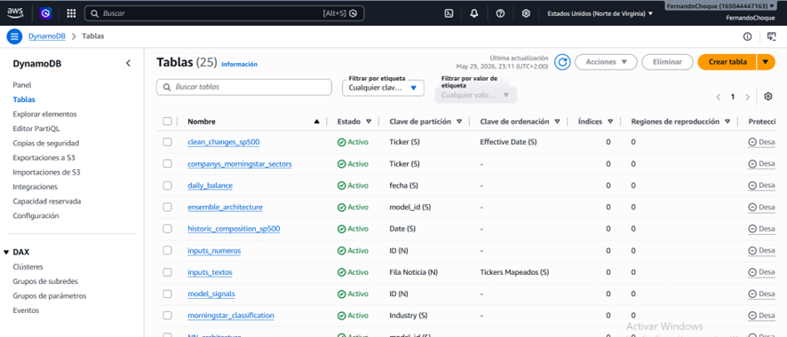
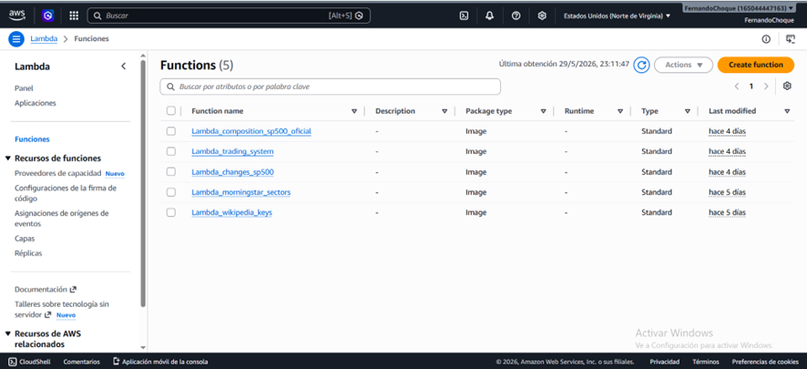
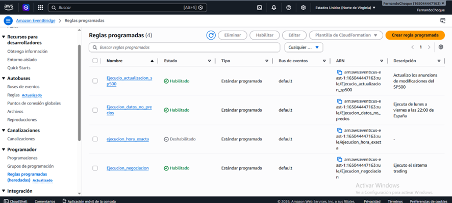
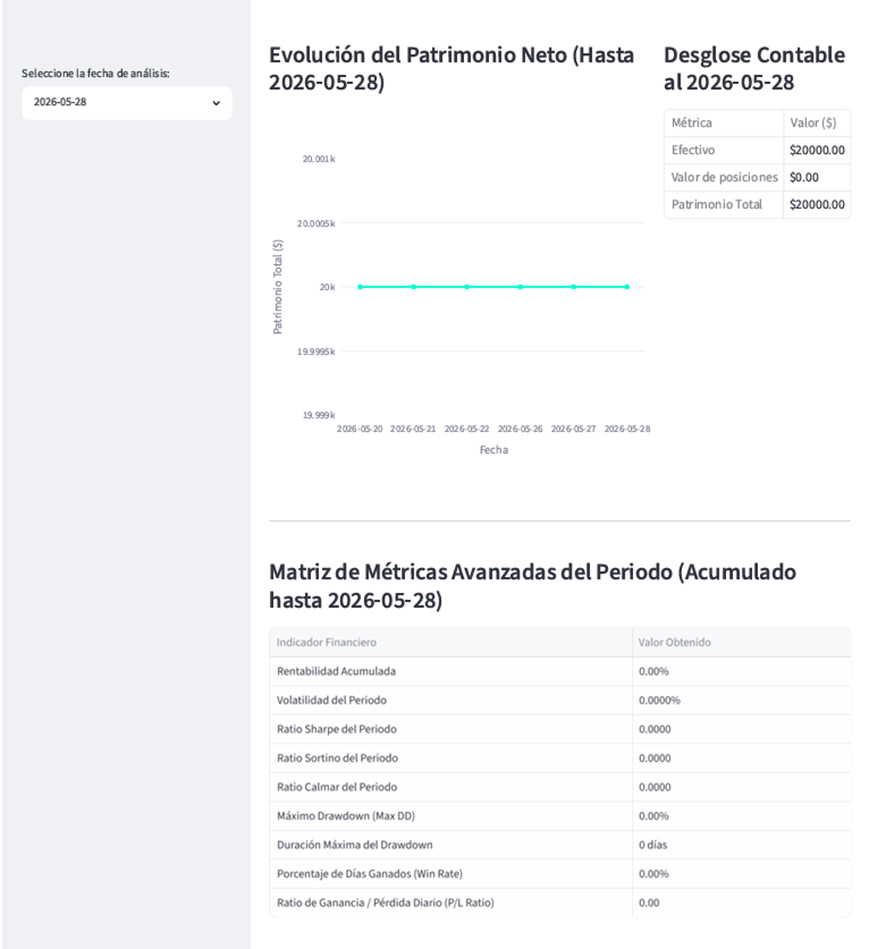

Pipeline de ejecucion en produccion:

Leyenda para relacionar el pipeline de produccion con los archivos .py:
Primero que nada, todos los codigos de ejecicion de produccion esta en src_production y los dockerfiles en dockerfile_production.

. Cambios S&P500: El codigo para revisar los cambios en el S&P500 esta en changes_sp500. Se ejecuta en un Lambda pusheado en ejecutar_datos.yaml

. Actualizacion Historico: El codigo para actualizar la composicion diaria del SP500 esta en composition_sp500. Se ejecuta en un Lamnda, pusheado en ejecutar_datos.yaml

. Web Scrapping Wikipedia: El codigo para actualizar las palabras claves de Wikipedia esta en update_wikipedia_keys. Se ejecuta en un Lambda, pusheado en ejecutar_datos.yaml

. Web Scrapping Digrin: El codigo para actualizar los sectores de Morningstar esta en update_morningstar. Se ejecuta con un Lambda, pusheado en ejecutar_datos.yaml

. API Alpaca: El codigo para actualizar precios de cierre y volumenes del dia esta en prices_and_volumes. Se ejecuta en github, porque en Lambda se excede el tiempo limite. Por tanto, no tiene dockerfile, se pushea en ejecutar_datos.yaml

. Procesamiento, Analisis e Inferencia: El codigo para extraer noticias, mapear noticias, hacer analisis gramatical, limpiar lo recibo del analisis gramatical, codificar los inputs y hacer inferencia con el algoritmo optimo estan en model_inference. El codigo se ejecuta en github, porque demorar entre 1 hora y 3 horas segun el día de la semana. El codigo se pushea en ejecutar_inferencia.yaml

. Sistema de trading: El codigo que negocia las señales obtenidas de model_inference es trading_system. Se ejecuta en Lambda, ousheado en ejecutar_negociacion.yaml

. Grafica de balance: El codigo coje la tabla daily_balance de AWS para graficar la evolucion del patrimonio diariamente y hacer calculos de metricas de rendimiento, riesgo y ratios de estos hasta la fecha seleccionada (metricas acumulativas), y una tabla de balance contable para el dia seleccionado para ver la composicion del patrimonio: cash y valor de posiciones. Todo esto lo ejecuta con streamlist, donde mas abajo dejo el link y una captura hasta el 28/05/2026.

Respecto a entrenamiendo:
Todo los codigos de entrenamiento están en src_training y todos se ejecutan en github, porque suelen tardar, entonces no necesitan dockerfiles. Ademas todos se pushean en ejecutar_training.yaml

. sp500_periodo_composition: Este codigo recoge la composicion del SP500 y lo guarda en 2 tablas: composicion diaria y tickers con su entrada y salida de todo el periodo (util esta ultima para saber siempre el total de empresa en el periodo)

. period_wikipedia_keys: Este codigo genera todas las palabras claves de empresas de todoas las empresas que estuvieron en el SP500 en el periodo de analisis.

. period_morningstar: Este codigo genera todas los sectores, grupos industrilaes e industrias al que pertenece todas las emrpresas que pertenecieron al SP500 durante el periodo de analisis.

. analisis_hasta_inputs_outputs: Este codigo extrae noticias, mapea noticias, hace analisis gramatical, limpia lo recibo del analisis gramatical, codifica los inputs y genera los outputs con todas las noticias para todo el periodo de analisis.

. train_inference_trading: Este codigo entrena y buscar distintas configuraciones de hiperaparametros para cada modelo y etiquetado. Por ultimo guarda la inferencia, es decir, la señaes del top 50, aunque debio ser 20,porque solo termine usando 20.

. trading_system: Este codigo genera los resultados y diario contables para los 20 mejores modelos, el algortimo optimo: modelo y configuracion de sistema tradin optimo, para distintos capitales iniciales y el historico.

. results: Este codigo calculos los resultados empiricos de optimizacion y backtesting.

Registro y captura de panatalla de servicios usados en AWS:
ECR:

S3(no se ven todos, pero si el total):

Dynamodb (no se ven todas las tablas, pero si el total):

Lambda:

Triggers de ejecucion:

Añado una caputar de Streamlist donde ejecuta el movimiento de mi patrimonio, donde el ultimo fue el 28/05/2026:

Revisando las ejecuccion, no hubo noticias que pasaran el filtro de ruido y mas cosas.

Los pipelines yaml de ejecucion estan desactivados por seguridad para evitar subir sin mi intencion. Pero todos funcionan perfectamente. 

Dejo la URL del streamlist para que pueda verlo y elegir la fecha que quieren analizar: https://6lpqnl5aakpzhqeeo7tmnk.streamlit.app/

De todas maneras mi github estara publico, os lo dejo el link aqui tambien: https://github.com/fernandoloro97/TFM